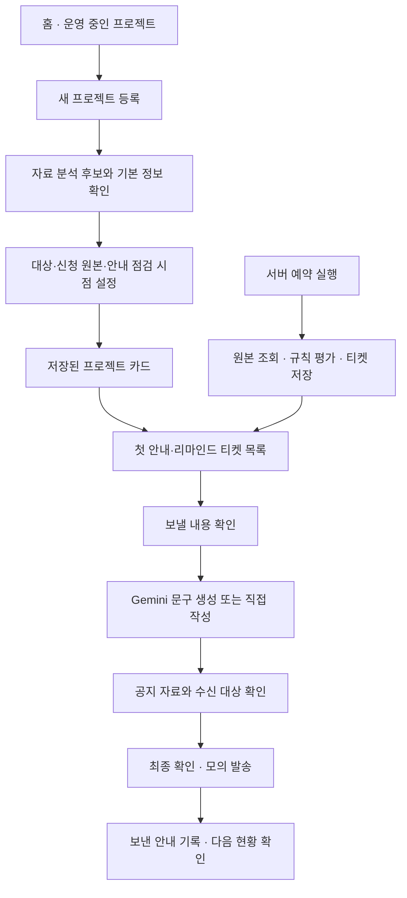

# SPEC 003 · 프로젝트 등록부터 안내 검토까지의 화면 흐름

작성일: 2026-10-07  
상태: **구현 목표 명세**. 이 문서의 요구사항을 현재 배포 기능으로 해석하지 않는다.

## 1. 목적과 기준 문서

대상 사용자는 기존 사내 행사·복지 프로젝트를 운영하면서 새 프로젝트를 등록하는 총무 담당자다. 담당자가 자료와 기본 정보를 한 번 정리하면, 이후 티켓에서 현재 프로젝트 정보를 바탕으로 공지 문구를 작성하고 신청 현황·자료·대상을 검토할 수 있어야 한다.

- [PRD](../docs/PRD.md)는 제품 목적과 점검 정책을 정한다.
- [PLAN](../docs/PLAN.md)은 구현 순서와 검증 상태를 관리한다.
- [SPEC 001](spec_001.md)은 **현재 동작**, 이 문서는 **수정할 동작**을 설명한다.
- [SPEC 002](spec_002.md)의 문서 분석, 자료·초안 저장, 파일 계약은 계속 적용한다. 검토 화면의 배치와 카드 재사용 방식은 이 문서를 따른다.

이번 구현의 결과는 **모의 발송과 기록 확인**까지다. 실제 Slack 발송·파일 전송·서버 승인 체계는 이번 완료 조건에 포함하지 않는다. 티켓은 담당자에게 검토할 일을 제안하며 AI 초안 생성이나 발송을 자동 실행하지 않는다.

## 2. 용어와 정보의 우선순위

| 용어 | 의미 |
| --- | --- |
| 프로젝트 정보 | 담당자가 문서 분석 결과를 검토하거나 직접 입력해 저장한 제목·대상·일정·마감·방법·링크·담당자·명단·안내 정책 |
| 프로젝트 카드 | 현재 저장된 프로젝트 정보를 읽기 쉽게 보여주는 요약 화면. 별도 버전 저장소가 아니라 저장된 프로젝트 값에서 만든다 |
| 이번 안내의 정보 | 새 티켓을 열 때 **현재 프로젝트 정보**에서 자동 준비한 AI 작성용 항목. 필요할 때만 이번 안내에 한해 수정·제외한다 |
| 분석용 자료 | 프로젝트 정보를 추출하기 위해 입력한 PDF·DOCX·TXT·MD·붙여넣은 내용. 공지에 자동 첨부하지 않음 |
| 공지용 자료 | 담당자가 이번 공지에 명시적으로 넣는 본문 링크와 첨부 파일. 프로젝트의 재사용 자료 또는 이번 안내만 추가한 자료 |
| 티켓 | 첫 안내 또는 리마인드의 검토 시점·이유·현황을 가진 작업. 티켓 생성과 공지 발송은 별개 |

**새 공지와 새 리마인드는 항상 최신 프로젝트 정보에서 시작한다.** 이전 안내의 마감·장소·신청 링크는 현재 프로젝트 값을 덮어쓰지 않는다. 이전 안내에서만 쓰던 보충 설명이나 자료는 운영자가 선택할 때만 가져온다. 프로젝트 수정 전에 이미 열어 작성하던 초안은 아래 7절의 재확인 규칙을 적용한다.

## 3. 담당자 흐름과 화면 이동



| 순서 | 담당자의 행동 | 시스템의 결과 |
| --- | --- | --- |
| 1 | 홈에서 `새 프로젝트 등록` | 기존 프로젝트를 유지하며 등록 화면으로 이동 |
| 2 | 관련 문서 분석 후 등록 입력칸 확인·수정 | 명확한 정보는 빈 입력칸에 채움. 기존 값·누락·충돌은 자동으로 덮어쓰거나 확정하지 않음 |
| 3 | 대상 명단·신청 원본·첫 안내 시점·리마인드 규칙을 입력하고 저장 전 예상 티켓 확인 | 프로젝트 카드와 규칙상 첫 안내·리마인드 검토 시점 생성 |
| 4 | 홈·프로젝트에서 이유와 시각이 있는 티켓 확인 | 필요한 시점의 티켓 표시. 같은 사유의 중복 방지 |
| 5 | 티켓에서 문구 생성 또는 직접 작성, 자료·대상 검토 | 최신 프로젝트 정보로 시작하며 저장 상태를 표시 |
| 6 | 최종 본문·자료·대상 승인 | 신청 원본을 재확인한 후 현재 범위의 모의 결과를 기록 |
| 7 | 기록과 다음 현황 확인 | 한 티켓의 완료가 프로젝트 종료나 신청 완료로 바뀌지 않음 |

## 4. 화면 A · 프로젝트 등록·수정

### 4.1 화면 구성

```text
프로젝트 등록/수정
  1. 자료로 정보 채우기: 파일·글 입력 → 분석 → 빈 등록 입력칸 채움·예외만 검토
  2. 프로젝트 기본 정보: 제목·담당자·대상·일정·마감·신청 방법·링크
  3. 신청 원본과 대상 명단: 원본 연결 상태·필수/자율 대상·확정 방식
  4. 안내 점검 설정: 첫 안내 검토 시각·리마인드 기본 규칙
  [운영 정보 미리보기/프로젝트 저장] → 요약 팝업에서 확인 후 저장
```

- 문서 분석은 **후보 제안**이다. 형식이 맞는 명확한 정보는 빈 등록 입력칸에 채우되, 프로젝트를 저장하기 전에는 서버 운영 정보로 확정되지 않는다. 자료에 없는 날짜·비용·혜택·링크를 추측해 채우지 않는다. 기존 입력값과 후보가 다르면 기존 값을 유지하고 예외 영역에서 선택할 수 있게 한다.
- 등록 화면은 프로젝트 입력칸을 한 번만 보여준다. `저장 전 운영 정보 요약`은 입력 화면 안에 상시 표시하지 않고 별도 팝업으로 제공한다. 미리보기나 저장을 누르면 현재 입력값·출처·확인 상태를 보여주고, 저장은 팝업에서 다시 확인해야 실행한다. 분석 결과에는 확인이 필요한 항목만 남기고 원문 근거는 접어서 볼 수 있게 한다.
- 새로 작성하는 공지는 프로젝트 수정·저장 뒤의 값을 사용한다. 이미 보낸 안내 기록은 당시의 값으로 유지한다.
- 로그인하지 않은 상태에서 저장을 완료한 것처럼 표시하지 않는다. 로그인 후 저장 중·저장됨·실패·충돌을 구분한다. 브라우저 저장 방식은 정상 작성 흐름의 안내 문구로 내세우지 않는다.

### 4.2 첫 안내와 리마인드 설정

- `첫 안내 검토 시각`은 선택 입력이다. 비워 두면 프로젝트 등록 직후 `첫 안내 준비` 티켓을 만든다. 미래 시각을 넣으면 그 시각의 검토 티켓을 예정 상태로 둔다. 입력 시각은 한국 시간으로 표시·저장하고 지난 시각을 선택하면 즉시 검토 대상으로 안내한다.
- 기본 리마인드 점검은 **D-3·D-1 오전 10시와 마감 4시간 전**의 필수 미신청자 확인이다. 자율 대상의 기본 목표는 기존 D-3 70%·D-1 90% 규칙을 유지한다. 프로젝트별 점검 시각·마감 전 간격·자율 목표·업무시간을 변경할 수 있다.
- D-3·D-1은 달력 날짜로 계산한다. 주말·전국 공휴일·업무시간 밖이면 기존 규칙대로 직전 업무시간으로 조정하고 원래 시각과 조정 시각을 보여준다. 공휴일 확인 실패 시 정상 점검으로 표시하지 않는다.
- 설정은 **검토할 시점**을 정한다. 티켓 생성 시 Gemini 호출이나 자동 발송을 하지 않는다.
- 저장 전 요약 팝업에는 입력한 대상과 일정에 따른 예상 티켓을 표시한다. 공휴일 기준을 아직 확인하지 못했다면 리마인드 시각을 추측하지 않고 확인 필요 상태를 보여준다.
- 필수 대상이 없으면 필수 점검 티켓은 만들지 않는다. 자율 대상이 있으면 목표를 입력하지 않아도 D-3·D-1에 신청 현황 확인 티켓을 만든다. 이때 목표 미달 판정은 하지 않는다. 신청 원본이 오래됐거나 실패했다면 시점만 보여주고 대상 수·신청률을 확정하지 않는다.

## 5. 화면 B · 프로젝트 카드와 티켓

- 프로젝트 카드에는 저장된 프로젝트 정보, 신청 원본의 종류와 마지막 성공 확인 시각, 대상·신청 인원, 첫 안내 시점과 리마인드 규칙, 최근 안내를 요약한다.
- 각 티켓에는 `검토 이유`, 원래·조정된 점검 시각, 사용한 신청 원본 확인 시각, 추천 대상 수, 상태(`예정`·`확인 대기`·`보류`·`완료` 등)를 표시한다. 시점만 도래했고 신청 상태가 불확실하면 `신청 현황 확인 필요`로 표시하며 미신청 인원을 확정해 말하지 않는다.
- 같은 프로젝트·사유·점검 시각은 하나의 티켓으로 관리한다. 신청·취소, 마감 변경, 프로젝트 종료, 보류 사유에 따라 **미발송** 티켓을 갱신·종료한다. 이미 처리한 안내 기록은 덮어쓰지 않는다.
- 첫 안내와 리마인드 티켓을 각각의 규칙으로 갱신한다. 리마인드 일정에 없다는 이유로 첫 안내 티켓을 종료하지 않는다.
- 화면을 다시 열면 서버에 저장된 최신 신청 스냅샷·티켓·실행 결과를 읽는다. 열린 화면에서는 수동 새로고침으로 원본을 다시 확인할 수 있다.

## 6. 화면 C · 보낼 내용 확인

```text
① 작성 기준: 공지 목적 + 자동 준비한 프로젝트 정보 요약
   [프로젝트 정보 수정] [이번 안내만 수정]
② 메시지: 말투 + [Gemini로 새 초안 문구 생성]
   생성 문구를 본문 입력 칸에 적용 · [생성 전 본문으로 되돌리기]
   본문 직접 편집 · 자동 저장 상태
③ 이번 안내에 포함할 자료: 프로젝트 자료 선택 / 새 링크·파일 추가
④ 대상과 신청 현황: 마지막 확인 시각 · [신청 현황 새로고침]
   DM/채널 · 대상 범위 · 실제 명단
⑤ 최종 확인: 본문 · 링크/파일 · 수신 대상 · 원본 시각
   [확인 완료] → [모의 발송]
```

### 6.1 작성 기준과 Gemini

- 새 티켓의 이번 안내 정보는 **현재 프로젝트 값**으로 만든다. 이전 안내의 보충 정보는 명시적으로 선택한 경우에만 추가한다. 프로젝트 전체 수정과 이번 안내만의 수정은 별도 동작이며 후자는 프로젝트의 기본값을 조용히 바꾸지 않는다.
- 핵심 정보가 비었거나 출처가 충돌하면 해당 항목을 표시한다. Gemini 생성에는 `무엇을`·`해야 할 일`·`마감`의 확인된 값이 필요하다. 포함 대상으로 선택했지만 확인되지 않은 항목이 있으면 생성 이유와 해결할 위치를 보여준다. 직접 본문을 쓰는 경로는 계속 제공한다.
- `Gemini로 새 초안 문구 생성`은 사용자가 눌렀을 때만 요청한다. 말투·공지 목적 변경만으로 네트워크 생성이나 현재 본문 교체를 하지 않는다. 검증된 결과는 본문 입력 칸에 바로 적용하고 생성 직전 본문으로 되돌릴 수 있다. 생성 중 본문·정보·대상이 바뀌면 결과로 덮어쓰지 않는다.
- 앱 서버는 포함·확인된 카드 값, 프로젝트 제목, 공지 목적, 말투만 Gemini 작성 자료로 사용한다. 신청자 명단·신청률·분석용 원본 파일·공지 첨부 파일은 자동 전달하지 않는다. 생성된 날짜·링크·수치와 근거 없는 주장은 검증한다.
- 말투 선택지는 겹치지 않는 의미의 `밝고 친근하게`, `간결하고 명료하게`, `정중하고 차분하게`, `행동 요청 중심으로`로 한다. 선택지를 바꿔도 카드의 정보는 바뀌지 않는다.

### 6.2 공지 자료

- 분석용 파일은 공지에 자동 첨부하지 않는다. 이번 안내에 포함할 링크·파일은 작성 화면에서 명시적으로 선택한다.
- 재사용 가능한 프로젝트 안내 자료를 고르거나 이번 안내에만 새 자료를 추가한다. 과거 안내의 자료는 제안할 수 있으나 자동 선택하지 않는다. 새 자료를 프로젝트 공통 목록에 넣을지 이번 안내에서만 쓸지 선택한다.
- 링크는 표시 문구와 URL을 확인해 본문에 넣는다. 파일은 본문과 별도의 첨부 카드로 이름·형식·크기·버전을 보여준다. 파일 교체·제거와 링크 수정은 승인 상태를 해제한다.
- 저장된 파일이나 링크가 Gemini의 작성 자료로 자동 사용되지는 않는다. 파일을 AI 작성에 반영하려면 등록 단계의 분석과 담당자 확인을 거친다.

### 6.3 대상·최종 확인·저장

- 신청 현황 새로고침은 대상 영역에 둔다. 마지막 성공 시각과 조회 실패를 함께 표시한다. 이 버튼이 Gemini 입력 정보를 갱신한다고 안내하지 않는다.
- 본문·자료·대상·방식·채널 중 하나가 바뀌면 최종 확인을 해제한다. 화면 재진입·새로고침 후에는 초안만 복원하고 확인 체크는 비운다.
- `임시 저장 중`·`임시 저장됨 · 시각`·`저장 실패`·충돌을 본문 가까이에 표시한다. 자동 저장을 유지하고 별도 `임시 저장` 버튼은 두지 않는다. 실패를 성공처럼 표시하지 않는다.
- 최종 확인에는 본문 전체, 본문 링크, 첨부 파일, DM 수신 명단 또는 채널 공개 범위, 신청 원본 확인 시각을 같은 화면에 보여준다. Sheets 기반 프로젝트의 모의 발송 직전에는 원본을 다시 읽어 신청 상태·대상 변경 또는 조회 실패 시 중단하고 재검토를 요구한다.
- 현재 범위에서 완료 버튼은 **모의 발송**이다. 기록에는 당시 본문·대상·자료·이번 안내의 정보·원본 확인 시각을 남긴다. 실제 Slack 도착이나 첨부 성공으로 표시하지 않는다.

## 7. 저장 데이터와 변경 처리

| 저장 대상 | 기준 |
| --- | --- |
| 프로젝트 | 현재 `operator_states`의 프로젝트 정보·적용한 문서 근거를 사용. 별도 프로젝트 카드 버전 테이블을 만들지 않음 |
| 초안 | 현재 `notice_drafts`의 본문·말투·목적·대상·자료·카드를 유지하고, **초안 작성에 사용한 프로젝트 주요 값**을 비교용으로 보관 |
| 안내 기록 | 보낸 당시 본문·대상·자료에 더해 **사용한 이번 안내 정보**의 스냅샷을 보관. 이후 프로젝트 수정으로 과거 기록을 바꾸지 않음 |
| 신청 원본·자동 티켓 | 현재 서버 스냅샷·불변 사건·티켓·실행 결과 구조를 사용. 소유 계정과 프로젝트를 연결하고 같은 규칙 키로 중복을 방지 |

프로젝트 수정 **이후 새로 여는 티켓**은 수정된 값으로 구성한다. 프로젝트 수정 **이전에 이미 작성 중이던 초안**은 저장한 기준값과 현재 프로젝트 값을 비교한다. 다른 항목(예: 마감·링크)을 보여주되 본문을 임의로 치환하지 않는다. 운영자가 이번 안내의 정보와 본문을 다시 확인할 때까지 승인·모의 발송을 막는다. 이전 안내의 보충 정보가 현재 프로젝트 값과 충돌하면 현재 프로젝트 값이 우선한다.

기존 저장 초안은 읽을 때 현재 필드로 변환하되 본문·대상·자료를 자동 삭제하지 않는다. 기준 프로젝트 값이 없는 옛 초안은 처음 재진입 시 현재 프로젝트 정보와 함께 검토를 요구한다. 다른 탭의 최신 초안을 조용히 덮어쓰지 않는다.

## 8. 화면 밖 정기 실행

브라우저를 닫아도 서버 예약 작업이 실행돼야 한다. 현재 기반은 Supabase Cron이 Edge Function을 호출해 예시 Google Sheets를 조회·평가하고 DB에 결과를 저장한다. [Supabase의 예약 함수 방식](https://supabase.com/docs/guides/functions/schedule-functions)을 따른다.

1. 예약 실행은 운영 중인 프로젝트의 첫 안내 검토 시각과 리마인드 규칙을 평가한다. Sheets 연동 프로젝트는 최신 원본을 읽고, 실패하거나 자료가 오래됐으면 성공으로 표시하지 않는다. 시트에 아직 연결되지 않은 프로젝트도 시점 확인 티켓은 만들 수 있으나 신청 상태를 근거로 대상·신청률을 확정하지 않는다.
2. 규칙 평가 결과는 `소유 계정 + 프로젝트 + 규칙/사유 + 예정 시각`의 안정적인 키로 저장한다. 같은 작업 재시도는 티켓·신청 사건을 중복 생성하지 않는다. 사유가 사라진 미발송 티켓은 종료하고 완료·보류 기록은 임의로 되돌리지 않는다.
3. 실행 시각, 원본 확인 시각, 처리 건수, 실패 이유를 저장한다. 실패 후 다음 실행에서 재시도한다. 예약 작업은 Gemini 생성·승인·발송을 호출하지 않는다.
4. 담당자가 다시 로그인하면 DB의 티켓과 마지막 실행 상태를 읽고 홈·프로젝트·캘린더에 일관되게 반영한다. 실행 실패는 신청 0명이나 `확인할 일 없음`으로 바꾸지 않는다.

현재 [`sync-sheets`](../supabase/functions/sync-sheets/index.ts)와 [`sheet-sync-hourly`](../supabase/cron-hourly.sql)은 **예시 시트에 연결된 프로젝트**를 평가한다. `docs/PLAN.md`의 2026-10-07 기록상 원격 매시간 작업을 활성화하고 임시 예약 실행의 저장을 확인했다. 첫 정시 실행, 운영자 브라우저의 반영·새로고침 복원, 모든 신규 프로젝트의 화면 밖 평가, 실패 복구는 별도 검증·확장이 필요하다. 현재 시간별 실행은 점검 시각 뒤 다음 실행에서 티켓을 반영하므로 분 단위 정확한 도착을 보장하지 않는다.

## 9. 구현 순서와 검증 기준

1. 등록·수정 화면의 단일 입력칸에서 분석값을 확인하고 첫 안내 검토 시각을 설정한다. 기존 리마인드 기본 규칙을 유지한다.
2. 최신 프로젝트 정보에서 새 안내를 구성하고, 이미 작성 중인 초안과의 변경 비교·승인 해제를 구현한다. 보낸 안내에 사용 정보 스냅샷을 남긴다.
3. 검토 화면을 6절 순서로 재배치하고 생성 버튼·말투·저장 문구·자료 선택을 정리한다. 프로젝트 공통 안내 자료와 이번 안내만 추가한 자료의 저장 범위를 연결한다.
4. 서버 예약 평가 범위를 모든 등록 프로젝트로 확장하고, 첫 안내 시각·원본 오류·중복 키를 처리한다. 브라우저 재접속 시 자동 티켓과 실행 상태를 복원한다.
5. 아래 검증을 완료한 범위만 [PLAN](../docs/PLAN.md)에 기록하고 [SPEC 001](spec_001.md)의 현재 동작을 갱신한다.

| 확인 대상 | 인수 조건 |
| --- | --- |
| 자료 입력 | 실제 문서와 직접 입력 → 후보 검토 → 프로젝트 저장 → 새 공지의 정보 자동 채움. 충돌·누락을 추측하지 않음 |
| 첫 안내·리마인드 | 즉시 또는 선택한 첫 안내 시각, D-3·D-1·마감 전 점검, 공휴일·업무시간 조정, 중복 없는 티켓 |
| 프로젝트 수정 | 마감·링크 수정 후 새 공지는 새 값 사용. 수정 전 초안은 변경을 알리고 재확인 전 모의 발송 불가 |
| Gemini | 확인·포함된 정보만 요청, 말투 변경으로 자동 재생성 안 함, 명시적 생성 후 본문 직접 적용·되돌리기 |
| 자료 | 분석용 파일 자동 첨부 없음. 선택 링크·파일과 버전이 본문/첨부·최종 확인·모의 기록에서 일치 |
| 저장 | 로그인 계정의 프로젝트·초안·티켓·기록을 새로고침 후 복원, 저장 실패·충돌 표시, 확인 체크 미복원 |
| 정기 실행 | 브라우저를 닫고 예약 실행 → 신청 원본·티켓·실행 결과 저장 → 재접속 복원. 반복 실행·실패·오래된 원본을 확인 |
| 모의 발송 | 최신 Sheets 재조회 실패·대상 변경 차단, 승인한 본문·자료·대상 기록, 실제 Slack 발송으로 표시하지 않음 |

검증 보고는 **코드 작성 / 로컬 자동 테스트 / 실제 Sheets·Supabase 연결 / 브라우저 사용자 흐름 / 배포 확인**으로 나눈다. 예시 응답과 모의 모델만으로 외부 연동 완료를 주장하지 않는다. 실제 계정·원본·테스트 대상과 미확인 단계를 기록한다.
